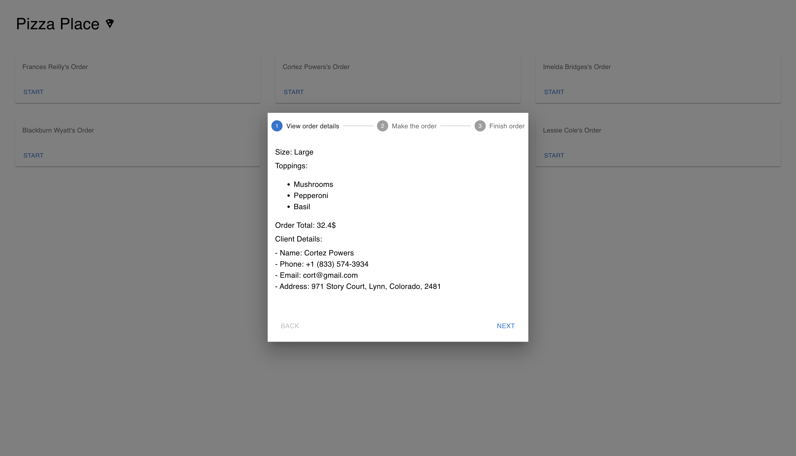

# Frontend Pizza Place app 

A React page that presents a list of orders in a pizza place.
* The user can click "start" on a specific order to view its details, and start preparing it.
* State management is Redux Toolkit, styling with MUI and SASS.

# Local run
You can view the app live on: https://pizzaplace.vercel.app/
 
To run locally: 
1. `npm install` `npm start`
2. View the project locally at http://localhost:3000

